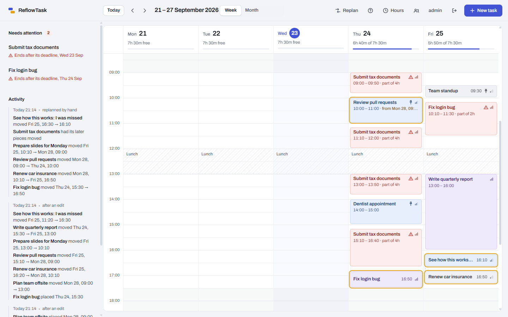
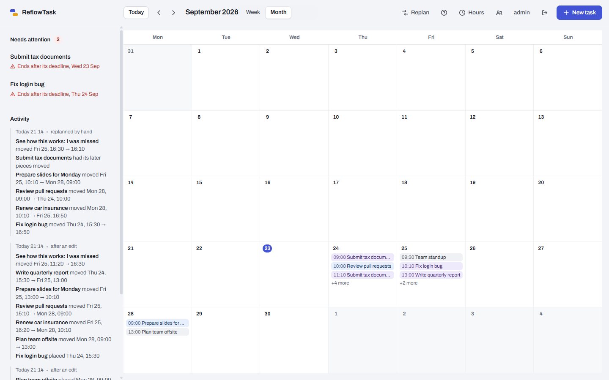
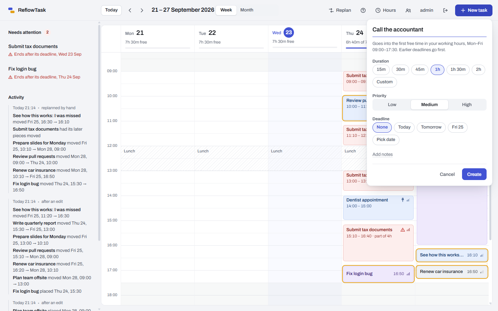
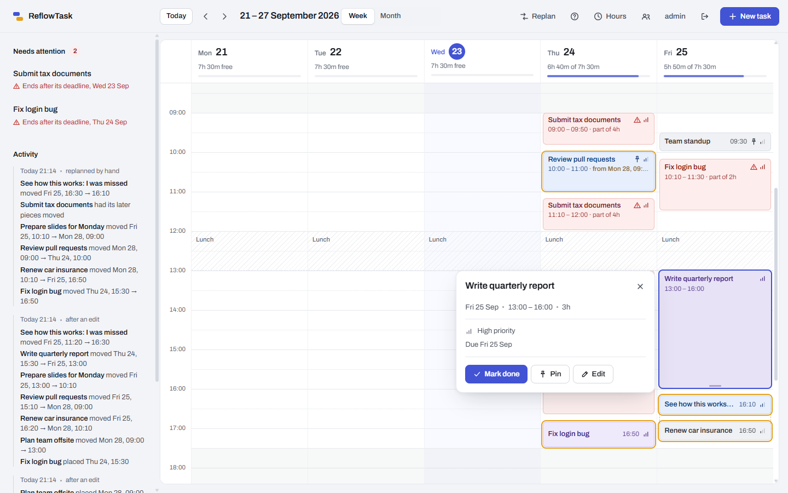
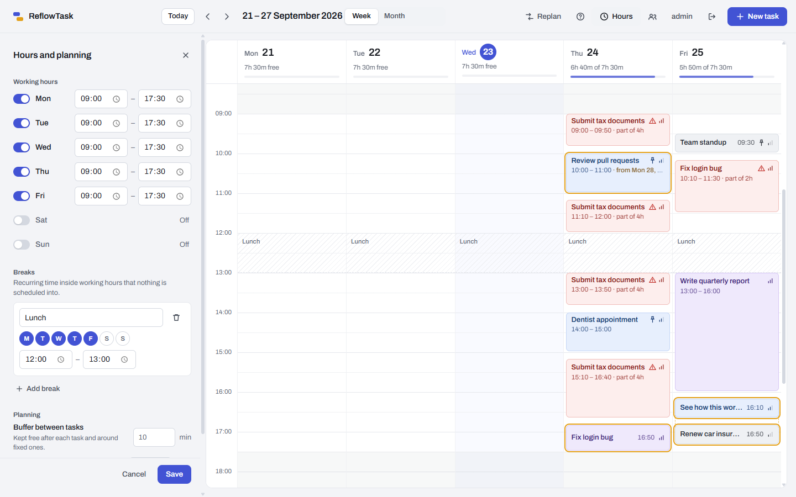

# ReflowTask

**A self-hosted task planner whose schedule repairs itself.**

Tasks carry an estimated duration as well as a deadline, so ReflowTask can place them as
concrete time blocks inside your working hours. When a block's time passes and the task isn't
done, it isn't left sitting there overdue for you to sort out: the scheduler replans everything
still open around it, and records what moved and why.

It runs on hardware you own, such as a Raspberry Pi, a home server or an old laptop, for one
person or a whole household. Everyone gets their own login and their own calendar.



<sub>Sample data on a Wednesday evening. The report and pull-request review were rearranged
around a dragged, pinned block (the amber outline marks what the last replan moved). Work that
cannot finish before its deadline is listed under **Needs attention**, and every replan is
written out under **Activity**.</sub>

- [Quick start](#quick-start)
- [What it does](#what-it-does)
- [How it differs from other planners](#how-it-differs-from-other-planners)
- [How the scheduling works](#how-the-scheduling-works)
- [Households: accounts and privacy](#households-accounts-and-privacy)
- [Documentation](#documentation)
- [Contributing and forking](#contributing-and-forking)

## Quick start

You need a machine that can run Docker (Linux, macOS, Windows, or a 64-bit Raspberry Pi OS) and
about 1 GB of free memory.

```bash
git clone https://github.com/KarimBk7/ReflowTask.git
cd ReflowTask
cp .env.example .env
# edit .env: set POSTGRES_PASSWORD, your TZ, and REFLOWTASK_INITIAL_ADMIN_PASSWORD
docker compose up -d --build
```

Then open `http://<your-machine>:8080` and log in as `admin` with the password you put in
`.env`. The first build takes a few minutes (a Raspberry Pi 5 needs about ten), because it also
runs the test suite.

The step-by-step guide, with screenshots, remote access, updating, backups and troubleshooting,
is in **[docs/SETUP.md](docs/SETUP.md)**.


## What it does

**Planning**

- Create tasks with a title, notes, estimated duration, deadline (a date, optionally with a
  time) and priority, picked mostly with chips rather than date pickers.
- New work is placed automatically into the first free time inside your working hours: earlier
  deadlines first, then higher priority.
- A task stays in one block when a free gap holds it, and is split into parts only when it must.
- **Missed blocks replan themselves.** An hourly job finds blocks whose time passed while the
  task was unfinished and places the task again.
- Work that cannot finish before its deadline is still scheduled and flagged **at risk**, never
  silently dropped or given a moved deadline.
- **Nothing moves silently.** Every replan is recorded with the reason and what moved where.

**Editing the calendar**

- Click free time to add a task there, fixed at that time or handed to the scheduler.
- Drag a block to move it (it is pinned where you drop it), or drag its bottom edge to resize it
  (the task's estimate follows). Alt + arrow keys do the same from the keyboard.
- Pin any block so replans leave it alone. The block you are inside right now is never moved.
- A workload meter per day: planned time against available working time.

| Week view | Month view |
| --- | --- |
|  |  |

The **month view** is a read-only overview of the whole month; click a day to open that week.

**Your week, your rules**

- Working hours per weekday, breaks such as lunch, a buffer between tasks, how far ahead to plan
  and the smallest piece a long task may be split into. Changing them replans immediately.
- Light and dark themes that follow your operating system.

| New task | Block details | Hours and planning |
| --- | --- | --- |
|  |  |  |

**For households**

- Every person has their own username, password, tasks, working hours and history.
- An admin adds and removes accounts and can reset a forgotten password.
- Whoever owns the device can recover any account from its command line, even the admin's.
- A short built-in guide explains how planning works, with your own hours filled in.


## How it differs from other planners

Most self-hosted task managers, such as Vikunja or Wekan, are lists and boards: when you miss
something it becomes "overdue", and rearranging the rest of the week is your problem. Hosted
tools such as Motion, Reclaim or Focuster do replan automatically, but they are services you
subscribe to, and your calendar lives on their servers. ReflowTask puts that replanning on
your own hardware.

| | ReflowTask | Task lists and boards (Vikunja, Wekan, ...) | Hosted auto-schedulers (Motion, Reclaim, ...) |
| --- | --- | --- | --- |
| Runs on your own hardware | Yes | Yes | No |
| Places tasks as time blocks by duration | Yes | Usually not | Yes |
| Replans when work is missed | Yes, hourly | No | Yes |
| Shows what moved and why | Yes, every replan | n/a | Varies |
| Several people, separate calendars | Yes | Yes | Usually per account |
| Needs an account with a vendor | No | No | Yes |
| Your data leaves your network | Never, unless you expose it | No | Yes |

It is not the only self-hostable planner (FluidCalendar is an open-source, self-hostable Motion
alternative), so its focus is **scheduling you can trust**: a deliberately simple, greedy
algorithm you can read in one sitting, every move recorded and shown, blocks you place or pin stay
put, and the work you are doing right now is never moved.

It also deliberately does **not** do some things: it is not an optimiser, it does not sync with
Google Calendar or CalDAV yet, and it is not built to be exposed to the internet (see
[Security](#security)). Third-party tools change; check their documentation for their current
features.

## How the scheduling works

The scheduler is the core of the project, and it is deliberately simple.

**Placement is a greedy pass.** Open tasks are sorted by deadline (earliest first, undated
last), then priority, then creation order, and each one takes the earliest free capacity inside
working hours. It is not an optimiser and doesn't pretend to be.

**Work stays in one piece when it can.** A task is kept in a single block when a free gap holds
it, as long as that does not start it later than splitting would or make it miss a deadline.
Work that no gap can hold, such as a six-hour task on a day with lunch, is split into parts, never
shorter than a configurable minimum except a task's final remainder. Each part says which task it
belongs to and how long the whole task is.

**Buffers are optional.** A configurable buffer keeps time free after each task and on both
sides of fixed blocks. It defaults to zero.

**A missed block triggers a replan.** A job runs every hour. Any block whose time has passed
while its task is unfinished is removed, and the task is placed again.

**Some blocks are never moved.** A replan keeps:

- blocks you have **pinned**, **created at a fixed time** or **dragged into place** — other work
  flows around them;
- a block you are **inside right now** — the scheduler won't move the thing you're working on;
- the past blocks of **completed** tasks, as the record of when the work happened.

Everything else in the future is rebuilt. Finishing a task early hands its remaining time back.

**Nothing moves silently.** Every replan that changes something is recorded with the reason and
what moved where. The calendar marks a moved block with where it came from, outlines its old
slot, and lets the rest of the week glide to its new place.

**Impossible deadlines are flagged, not hidden.** Work that can't fit before its deadline is
still scheduled at the earliest possible time and marked at risk, rather than dropped or having
its deadline quietly moved.

All times are wall-clock times: 09:00 means 09:00, and daylight-saving changes don't shift your
working hours.

## Households: accounts and privacy

ReflowTask has a **household login**, not an internet-grade account system. Each person has their
own username and password and sees only their own tasks, working hours and activity; a stranger's
id looks exactly like an id that does not exist. An admin can add and remove accounts, choose a
role (member or admin) and set a new temporary password for someone who is locked out.

- Passwords are stored only as bcrypt hashes, at least 8 characters.
- Usernames are case-insensitive (`Maria` and `maria` are the same person).
- A session is a random token in an `HttpOnly`, `SameSite=Lax` cookie and lasts 30 days.
- Five wrong passwords in a row lock that username for a minute.
- Removing an account deletes all of its tasks, hours and history.

**Locked out?** Whoever has a shell on the device can reset any account, including the admin's,
without logging in:

```bash
./scripts/reset-password.sh alice            # prints a random temporary password
./scripts/reset-password.sh alice "my-temp-pass-1"
```

The person must choose their own password at next login, and all their sessions end. Details, and
how to do it without Docker, are in [docs/SETUP.md](docs/SETUP.md#forgot-a-password).

## Security

**Read this before exposing it.** The intended setup is a private network: run it at home and
reach it from elsewhere over a VPN such as [Tailscale](https://tailscale.com) or WireGuard. **Do
not port-forward it or expose it to the internet.** The login separates the people sharing one
instance from each other; it is not what keeps strangers out.

- A fresh install starts with an `admin` account. Set `REFLOWTASK_INITIAL_ADMIN_PASSWORD` in `.env`
  before the first start, or the password is `changeme` and the app makes you change it at first
  login. Either way, do it before anyone else can reach the port.
- The session cookie has no `Secure` flag, because plain HTTP inside a private network would never
  send one. Put it behind an HTTPS reverse proxy if you want one, and see
  [docs/SETUP.md](docs/SETUP.md#https).
- A cookie belongs to one hostname: opening the same server by its LAN name and by its Tailscale
  name means logging in twice. That is a known limitation, not a bug.
- There is no email, no password-reset link and no OAuth. Recovery is a command on the device.

Found a vulnerability? See [SECURITY.md](SECURITY.md).

## Documentation

| | |
| --- | --- |
| [docs/SETUP.md](docs/SETUP.md) | Install, first login, add people, remote access, HTTPS, update, back up, recover a password, troubleshoot |
| [CONTRIBUTING.md](CONTRIBUTING.md) | Fork it, run it for development, project layout, tests, and where to add a feature |
| [PRODUCT.md](PRODUCT.md) | Who this is for and the decisions behind it |
| [DESIGN.md](DESIGN.md) | The visual design system |

## API

All endpoints live under `/api/v1` and, except `POST /auth/login`, need a logged-in session.
Validation failures and missing resources are returned as RFC 7807 problem details, validation
failures include a field-by-field `errors` map, conflicts (such as fixing work over another fixed
block or in the past) return `409`, and a login lockout returns `429`. Date-times are sent and
returned without a time zone, for example `2026-09-21T09:00:00`. The web app is one client of this
API, so a mobile client could use the same endpoints.

| Method | Path | Purpose |
| --- | --- | --- |
| `POST` | `/auth/login` | Log in; sets the session cookie |
| `POST` | `/auth/logout` | End this session |
| `GET` | `/auth/me` | Who am I, and must I change my password |
| `POST` | `/auth/change-password` | Change your password (`currentPassword` is required unless it was just set for you) |
| `GET` `POST` | `/users` | Admin: list accounts; create one (`username`, `password`, optional `role`) |
| `POST` | `/users/{id}/reset-password` | Admin: set a new temporary password |
| `DELETE` | `/users/{id}` | Admin: remove an account and everything it owns |
| `GET` | `/tasks` | List your tasks, each with its scheduled minutes and at-risk state |
| `GET` | `/tasks/{id}` | Get one task |
| `POST` | `/tasks` | Create a task and replan; an optional `fixedStart` pins it at that time |
| `PUT` | `/tasks/{id}` | Update everything except status, and replan |
| `PATCH` | `/tasks/{id}/status` | Change status, for example to mark it done, and replan |
| `DELETE` | `/tasks/{id}` | Delete a task and replan |
| `GET` | `/schedule?from=…&to=…` | Your blocks overlapping a date-time range |
| `POST` | `/schedule/replan` | Replan now |
| `PATCH` | `/schedule/blocks/{id}` | Move or resize a block (`startAt`, `endAt`); pins it, adjusts the estimate, replans |
| `POST` | `/schedule/blocks/{id}/pin` | Pin a block so replans leave it in place |
| `POST` | `/schedule/blocks/{id}/unpin` | Unpin a block |
| `GET` | `/reschedule-events` | Your recent replans and what they moved |
| `GET` `PUT` | `/config` | Your working hours, breaks, buffer and planning settings; `PUT` replaces them and replans |

## Tech stack

| Part | Technology |
| --- | --- |
| Backend | Java 25, Spring Boot 4.1, Spring Data JPA, Bean Validation, spring-security-crypto (bcrypt only) |
| Database | PostgreSQL in production, H2 in development; schema managed by Flyway |
| Frontend | React 19, TypeScript, Vite 8, TanStack Query |
| API | REST, versioned under `/api/v1` |
| Deployment | Docker Compose: PostgreSQL, backend, nginx |

## Testing

```bash
cd backend && ./mvnw test        # 150+ tests
cd frontend && npm test          # unit tests for dates and board logic
cd frontend && npm run build     # typecheck and production build
```

The backend tests run again inside `backend/Dockerfile`'s build stage, so a broken image never
gets as far as `docker compose up`. The placement algorithm is a pure function (tasks, obstacles,
configuration and the current time in, blocks out), so most of its rules are tested directly
without a database. Replanning, missed blocks, configuration, accounts, sessions, login
throttling, password recovery and per-user data isolation are tested end to end against H2 with a
controllable clock. Every endpoint that takes an id is tried with another user's id, and every
endpoint is tried without a session.

## Project structure

```
backend/
  src/main/java/dev/karimbk/reflowtask/
    task/        tasks: entity, API, validation
    schedule/    placement algorithm, replanning, the hourly job, replan history
    config/      per-user working hours, blocked time, planning settings
    user/        accounts, sessions, login throttling, account recovery
    common/      shared error handling
  src/main/resources/db/migration/    Flyway migrations (V1 to V6)
frontend/
  src/api/       typed API client
  src/auth/      login, password and account screens
  src/week/      the week calendar, popovers, sidebar and hours panel
  src/month/     the month overview
  src/design/    design tokens and styles
scripts/         reset-password.sh
docs/            setup guide and screenshots
docker-compose.yml, backend/Dockerfile, frontend/Dockerfile   deployment
```

## Status

Working and in daily use, including on a Raspberry Pi 5: task management, automatic placement,
replanning, pinning, the week and month calendars, per-person accounts, configuration, and Docker
Compose deployment with PostgreSQL.

Known limitations:

- The custom deadline date and the working-hours times use the browser's own inputs, so their
  format follows the browser's language rather than the app's.
- The outline of a moved block's old slot is a fixed 30-minute marker, because the replan record
  keeps only start times.
- Dragging blocks works with a mouse or pen; on a touch screen a block is tapped to open it.
- The interface is English only, though every string lives in one file
  (`frontend/src/i18n/en.ts`) so a translation is a data change.
- Login lockout is kept in memory, so it resets when the server restarts.

Ideas for later: calendar sync (CalDAV), recurring tasks, task dependencies, and a mobile client.
Pull requests are welcome.

## Contributing and forking

Fork it and make it yours: the scheduler is small on purpose, and
[CONTRIBUTING.md](CONTRIBUTING.md) shows the layout, how to run everything for development, the
test conventions, and where each kind of feature belongs.

## License

[MIT](LICENSE)
