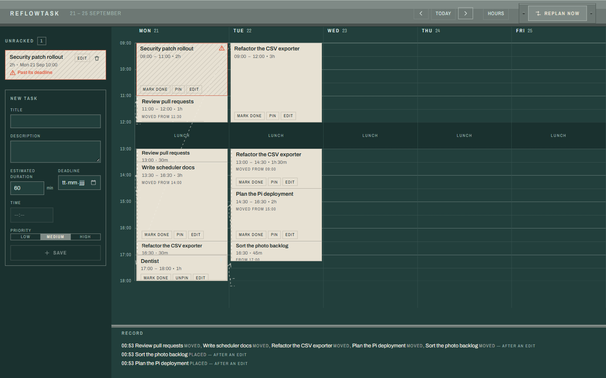

# ReflowTask

A self-hosted task manager whose schedule repairs itself.

Tasks carry an estimated duration as well as a deadline, so ReflowTask can place them as
concrete time blocks inside your working hours. When a block's time passes and the task isn't
done, it isn't left sitting there overdue for you to sort out: the scheduler replans everything
still open around it, and records what moved and why.



<sub>Sample data. Right after one short task was completed early: the time it freed was taken by
the tasks behind it, a pinned appointment held its slot while work flowed around it, and a task
that cannot finish before its 10:00 deadline is flagged at risk.</sub>

## Why

Most open-source task managers, such as Vikunja and Wekan, don't replan for you. When you miss
something it becomes "overdue", and rearranging the rest of the week is your problem.
Commercial tools such as Focuster do replan automatically, but they are hosted services.

ReflowTask is the self-hosted version of that idea: the scheduling runs on your own hardware.

## How the scheduling works

The scheduler is the core of the project, and it is deliberately simple.

**Placement is a greedy pass.** Open tasks are sorted by deadline (earliest first, undated
last), then priority, then creation order, and each one takes the earliest free capacity inside
working hours. It is not an optimiser and doesn't pretend to be.

**Work splits when it has to.** A four-hour task that no single gap can hold is spread across
several blocks — but never into pieces smaller than a configurable minimum, except a task's final
remainder.

**A missed block triggers a replan.** A job runs every hour. Any block whose time has passed
while its task is unfinished is removed, and the task is placed again.

**Some blocks are never moved.** A replan keeps:

- blocks you have **pinned**, such as a fixed appointment — other work flows around them;
- a block you are **inside right now** — the scheduler won't move the thing you're working on;
- the past blocks of **completed** tasks, as the record of when the work happened.

Everything else in the future is rebuilt. Finishing a task early hands its remaining time back.

**Nothing moves silently.** Every replan that changes something is recorded with the reason and
what moved where. The board marks moved blocks and draws where they came from.

**Impossible deadlines are flagged, not hidden.** Work that can't fit before its deadline is
still scheduled at the earliest possible time and marked at risk, rather than dropped or having
its deadline quietly moved.

All times are wall-clock times: 09:00 means 09:00, and daylight-saving changes don't shift your
working hours.

## Features

- Create, edit, complete and delete tasks — title, description, estimated duration, deadline
  (date with an optional time) and priority
- A week board showing placed blocks, with pin, complete and edit on each block
- Automatic placement on every change, and an hourly replan for missed work
- Configurable working hours per weekday, recurring blocked time (such as lunch), planning
  horizon and minimum block size — changing them replans immediately
- A history of every replan, with what moved and why
- Light and dark themes that follow your OS

## Tech stack

| Part | Technology |
| --- | --- |
| Backend | Java 25, Spring Boot 4.1, Spring Data JPA, Bean Validation |
| Database | PostgreSQL in production, H2 in development; schema managed by Flyway |
| Frontend | React 19, TypeScript, Vite 8, TanStack Query |
| API | REST, versioned under `/api/v1` |

The web frontend is one client of the API rather than a privileged part of the backend, so a
mobile client could use the same endpoints without backend changes.

## Running it locally

**Prerequisites:** Java 25 and Node.js 22 or newer. Maven isn't needed; the backend includes the
Maven wrapper.

Start the backend — it runs on port 8080 with an H2 database stored in `backend/data/`:

```bash
cd backend
./mvnw spring-boot:run
```

Then start the frontend in a second terminal — it serves on port 5173 and proxies `/api` to
the backend:

```bash
cd frontend
npm install
npm run dev
```

Open <http://localhost:5173>. A fresh database starts with Monday–Friday, 09:00–18:00, and a
12:00–13:00 lunch break; change them from the **Hours** button.

## Running against PostgreSQL

The `prod` profile reads its database connection from the environment:

```bash
export SPRING_PROFILES_ACTIVE=prod
export SPRING_DATASOURCE_URL=jdbc:postgresql://localhost:5432/reflowtask
export SPRING_DATASOURCE_USERNAME=reflowtask
export SPRING_DATASOURCE_PASSWORD=...
./mvnw spring-boot:run
```

Flyway creates the schema on first start.

> **Not yet verified against PostgreSQL.** The migrations are written to run on both H2 and
> PostgreSQL, but so far they have only been run, and tested, on H2.

## Security model — read this before exposing it

**ReflowTask has no authentication.** There is no login and no user account; anyone who can
reach the port can read and change the schedule.

The intended setup is a private network. Run it on a home server and reach it over a VPN such as
Tailscale or WireGuard, so access is controlled at the network layer. **Do not port-forward it or
expose it to the internet.** Adding login is on the roadmap, but only if the project gets that far.

## API

All endpoints live under `/api/v1`. Validation failures and missing resources are returned as
RFC 7807 problem details, and validation failures include a field-by-field `errors` map.

| Method | Path | Purpose |
| --- | --- | --- |
| `GET` | `/tasks` | List tasks, each with its scheduled minutes and at-risk state |
| `GET` | `/tasks/{id}` | Get one task |
| `POST` | `/tasks` | Create a task and replan |
| `PUT` | `/tasks/{id}` | Update everything except status, and replan |
| `PATCH` | `/tasks/{id}/status` | Change status, for example to mark it done, and replan |
| `DELETE` | `/tasks/{id}` | Delete a task and replan |
| `GET` | `/schedule?from=…&to=…` | Blocks overlapping a date-time range |
| `POST` | `/schedule/replan` | Replan now |
| `POST` | `/schedule/blocks/{id}/pin` | Pin a block so replans leave it in place |
| `POST` | `/schedule/blocks/{id}/unpin` | Unpin a block |
| `GET` | `/reschedule-events` | Recent replans and what they moved |
| `GET` | `/config` | Working hours, blocked time and planning settings |
| `PUT` | `/config` | Replace the whole configuration and replan |

Date-times are sent and returned without a time zone, for example `2026-09-21T09:00:00`.

## Testing

```bash
cd backend
./mvnw test
```

The backend has 58 tests. The placement algorithm is a pure function — tasks, obstacles,
configuration and the current time in, blocks out — so most of its rules are tested directly
without a database. Replanning, missed blocks and configuration changes are tested end to end
against H2 with a controllable clock.

The frontend has no automated tests yet.

## Project structure

```
backend/
  src/main/java/dev/karimbk/reflowtask/
    task/        tasks: entity, API, validation
    schedule/    placement algorithm, replanning, the hourly job, replan history
    config/      working hours, blocked time, planning settings
    common/      shared error handling
  src/main/resources/db/migration/    Flyway migrations
frontend/
  src/api/       typed API client
  src/week/      the week board, task rail and forms
  src/design/    design tokens and styles
PRODUCT.md       who this is for and the decisions behind it
DESIGN.md        the visual design system
PROJECT_SPEC.md  the original project brief (German)
```

## Status

The MVP scope is complete: task management, automatic placement, replanning, pinning, the week
board and configuration all work.

Not built yet:

- **Deployment.** The goal is Docker Compose on a Raspberry Pi. There is no Dockerfile or
  Compose file yet, and nothing has been tested on a Pi.
- **Frontend tests.**

Known issues:

- On short blocks, the note saying where a block moved from can be clipped.
- When a task moves to a different day, its arrow can cross other blocks' text.
- Date and time inputs use the browser's own controls, so their format follows the browser's
  language rather than the app's.

Possible later additions include login, calendar sync (CalDAV), recurring tasks, task
dependencies, and a mobile client.

## License

[MIT](LICENSE)
