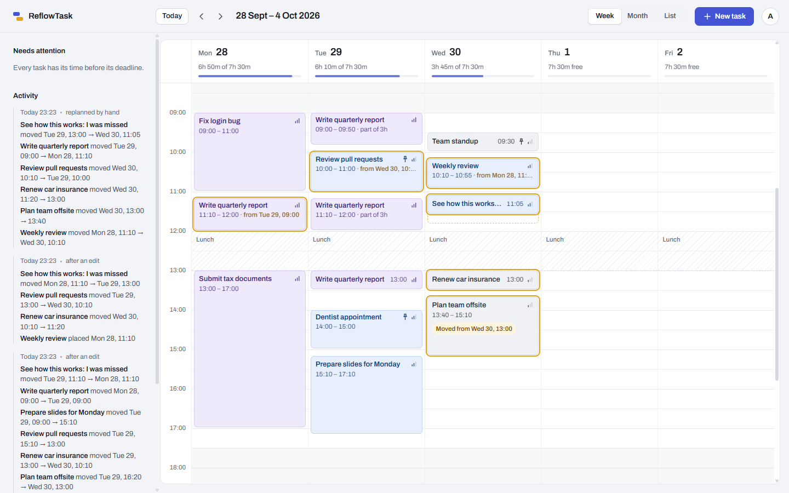
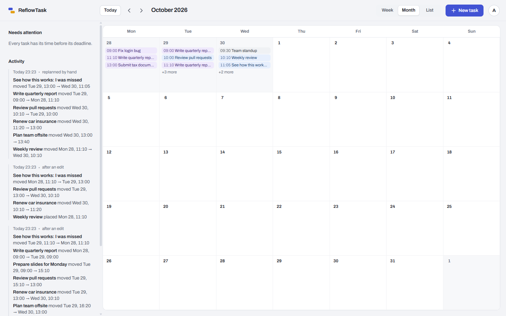
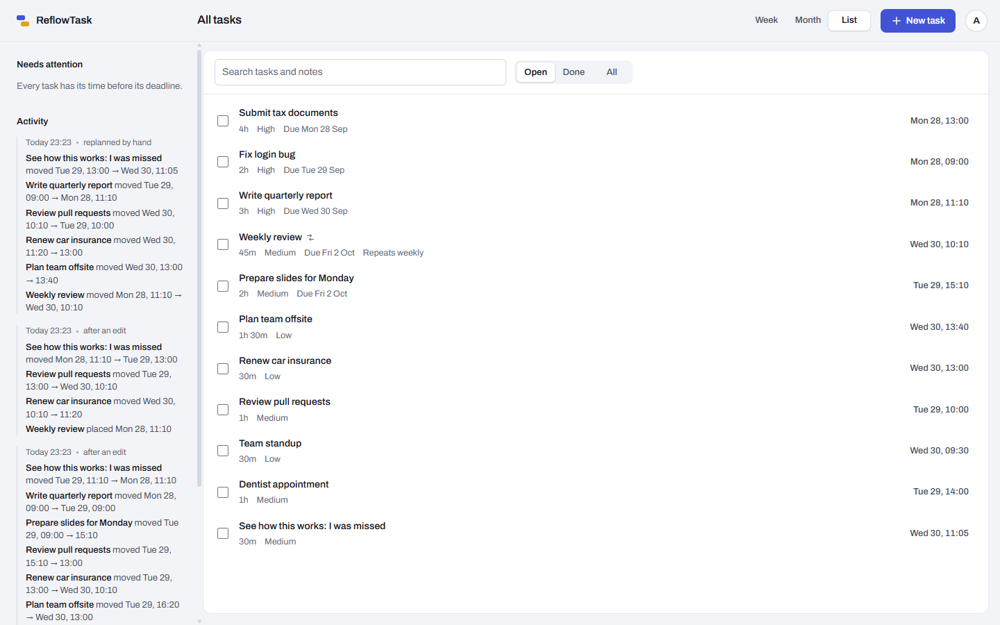
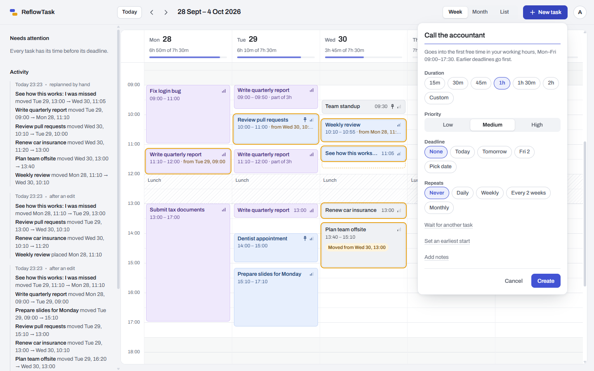
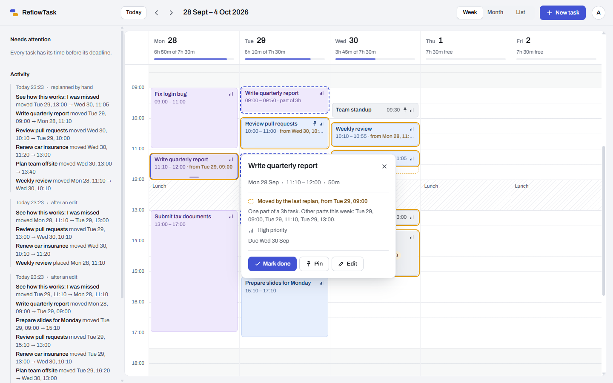
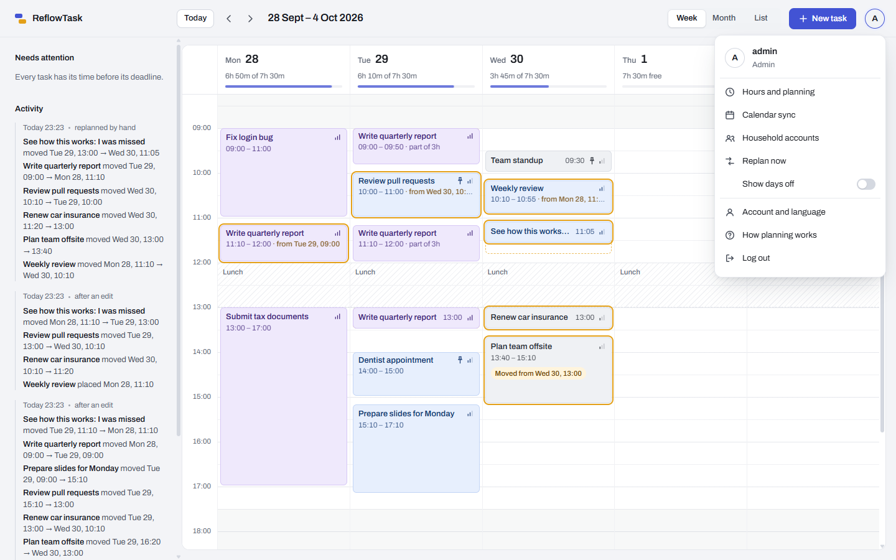
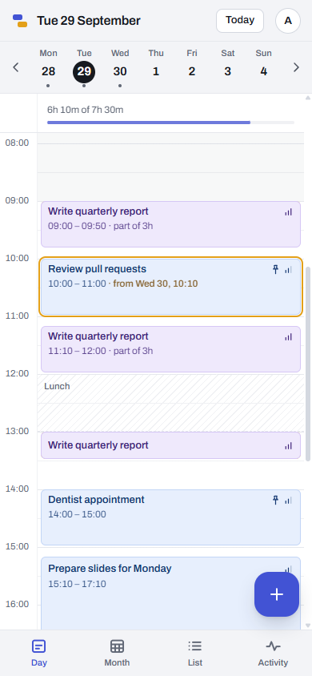
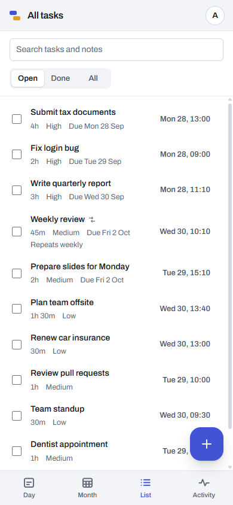
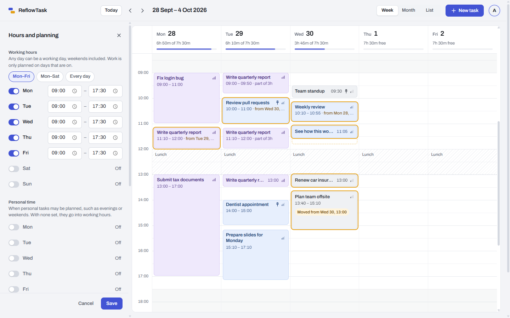
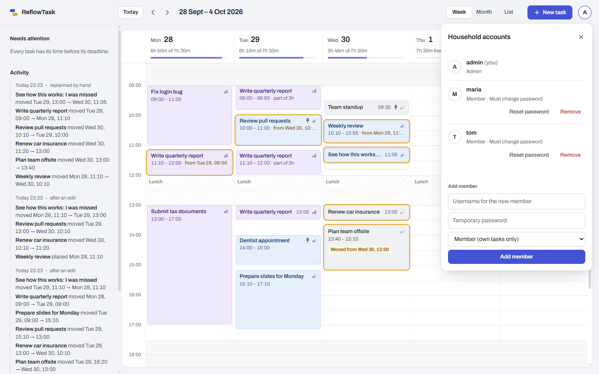

# ReflowTask

[](https://github.com/KarimBk7/ReflowTask/actions/workflows/ci.yml)
[](https://github.com/KarimBk7/ReflowTask/releases)
[](LICENSE)

**A self-hosted task planner whose schedule repairs itself.**

Tasks carry an estimated duration as well as a deadline, so ReflowTask can place them as
concrete time blocks inside your working hours. When a block's time passes and the task isn't
done, it isn't left sitting there overdue for you to sort out: the scheduler replans everything
still open around it, and records what moved and why.

It runs on hardware you own, such as a Raspberry Pi, a home server or an old laptop, for one
person or a whole household. Everyone gets their own login and their own calendar, on the desktop
and on the phone.



<sub>Sample data for the week ahead. The pull-request review was dragged to Tuesday and pinned
there, and the next replan fitted the rest around it: every block it moved carries an amber ring
and says where it came from. Every replan is written out under **Activity**; work that cannot
finish before its deadline would be listed under **Needs attention**.</sub>

- [Quick start](#quick-start)
- [What it does](#what-it-does)
- [How it differs from other planners](#how-it-differs-from-other-planners)
- [How the scheduling works](#how-the-scheduling-works)
- [Calendar sync](#calendar-sync)
- [Households: accounts and privacy](#households-accounts-and-privacy)
- [Android app without a server](#android-app-without-a-server)
- [Security](#security)
- [Documentation](#documentation)
- [API](#api)
- [Development](#development)

## Quick start

You need a machine that can run Docker (Linux, macOS, Windows, or a 64-bit Raspberry Pi OS) and
about 1 GB of free memory.

```bash
git clone https://github.com/KarimBk7/ReflowTask.git
cd ReflowTask
git checkout v1.0.0          # the latest release; leave this out to run the newest code
cp .env.example .env
# edit .env: set POSTGRES_PASSWORD, your TZ, and REFLOWTASK_INITIAL_ADMIN_PASSWORD
docker compose up -d --build
```

Then open `http://<your-machine>:8080` and log in as `admin` with the password you put in `.env`.
The first build takes a couple of minutes on a PC and five to ten on a Raspberry Pi 5, because it
also runs the test suite; later starts take seconds.

The step-by-step guide, with screenshots, remote access from your phone, updating, backups and
troubleshooting, is in **[docs/SETUP.md](docs/SETUP.md)**. What changed between versions is in
[CHANGELOG.md](CHANGELOG.md).

## What it does

### Planning

- Create tasks with a title, notes, estimated duration, priority and an optional deadline (a date,
  optionally with a time), picked mostly with chips rather than date pickers.
- New work goes into the first free time inside your working hours: earlier deadlines first, then
  higher priority. A task stays in one block when a gap holds it and is split only when it must.
- **Missed blocks replan themselves.** An hourly job finds blocks whose time passed while the task
  was unfinished and places the work again. The missed block stays as a record, and "I did this"
  still counts it.
- **Progress counts.** Mark a single part of split work done and only the rest is planned.
- Work that cannot finish before its deadline is still scheduled and flagged **at risk**, never
  silently dropped or given a moved deadline.
- **Repeating tasks**: daily (every working day), weekly, every two weeks or monthly. Finish one and
  the next appears, due one step later.
- **Earliest start**: work that cannot begin yet (a delivery, a reply, next month) is not planned
  before the day you pick.
- **One task after another**: a task can wait for another and is planned only once that one is
  over; if it is the more urgent of the two, the one it waits for moves up.
- **Work and personal time**: set personal hours (evenings, weekends) beside your working hours and
  mark a task Personal; it is planned only there. Nothing is ever planned twice at once.
- **Nothing moves silently.** Every replan is recorded with the reason and what moved where.

### The calendar

- Click free time to add a task there, fixed at that time or handed to the scheduler.
- Drag a block to move it (it is pinned where you drop it), or drag its bottom edge to resize it
  (the task's estimate follows). Alt + arrow keys do the same from the keyboard.
- Pin any block so replans leave it alone. The block you are inside right now is never moved, and
  "keep upcoming work in place" stops a new urgent task from reshuffling the next hour or two.
- **Undo** a move, a resize or marking something done, from the message that follows or with
  Ctrl+Z.
- A workload meter per day: planned time against available working time.
- A **month view** as an overview (click a day to open its week) and a **list view** of every task,
  planned or not, with search and filters.
- The top bar keeps only what planning needs every few minutes. Settings, calendar sync, the
  household, help and logging out sit in the menu behind your initial.

| Month view | List view |
| --- | --- |
|  |  |

| New task | Block details | The menu behind your initial |
| --- | --- | --- |
|  |  |  |

### On your phone

- Laid out like a calendar app, not a squeezed desktop: one day at a time with the week as a strip
  above it, the views as tabs at the bottom and New task as a round button in reach of your thumb.
- Press and hold a block to drag it; a tap still opens it and a swipe still scrolls.
- Add it to the home screen and it opens full screen with its own icon.

| Day | List |
| --- | --- |
|  |  |

### Calendar sync

- Subscribe to your plan from the calendar app on your phone or desktop, with reminders.
- Add other calendars (work, family, Nextcloud, Google, Outlook, iCloud) by their `.ics` address.
  Their appointments block time, show on the week view, and tasks are planned around them. See
  [Calendar sync](#calendar-sync).

### Your week, your rules

- Working hours per weekday (weekends and shifts included), breaks such as lunch, a buffer between
  tasks, how far ahead to plan and the smallest piece a long task may be split into. Changing them
  replans immediately.
- English and German. The browser's language decides, and anyone can switch in the menu. A new
  language is one file: copy `frontend/src/i18n/de.ts`.
- Light and dark themes that follow your operating system.



### For households

- Every person has their own username, password, tasks, working hours, calendars and history.
- An admin adds and removes accounts and can reset a forgotten password; whoever owns the device can
  recover any account from its command line, even the admin's.
- A short built-in guide explains how planning works, with your own hours filled in.
- Anyone can download their own data: everything as JSON, or the task list as CSV for a
  spreadsheet. The JSON includes the addresses of your other calendars, which are often secret
  links, so keep the file private.



## How it differs from other planners

Most self-hosted task managers, such as Vikunja or Wekan, are lists and boards: when you miss
something it becomes "overdue", and rearranging the rest of the week is your problem. Hosted
tools such as Motion, Reclaim or Focuster do replan automatically, but they are services you
subscribe to, and your calendar lives on their servers. ReflowTask puts that replanning on your own
hardware.

| | ReflowTask | Task lists and boards (Vikunja, Wekan, ...) | Hosted auto-schedulers (Motion, Reclaim, ...) |
| --- | --- | --- | --- |
| Runs on your own hardware | Yes | Yes | No |
| Places tasks as time blocks by duration | Yes | Usually not | Yes |
| Replans when work is missed | Yes, hourly | No | Yes |
| Shows what moved and why | Yes, every replan | n/a | Varies |
| Plans around your other calendars | Yes, by `.ics` subscription | Usually not | Yes |
| Several people, separate calendars | Yes | Yes | Usually per account |
| Needs an account with a vendor | No | No | Yes |
| Your data leaves your network | Never, unless you expose it | No | Yes |

It is not the only self-hostable planner (FluidCalendar is an open-source, self-hostable Motion
alternative), so its focus is **scheduling you can trust**: a deliberately simple, greedy algorithm
you can read in one sitting, every move recorded and shown, blocks you place or pin stay put, and
the work you are doing right now is never moved.

It also deliberately does **not** do some things: it is not an optimiser, it reads and publishes
calendars as subscriptions rather than editing them over CalDAV, and it is not built to be exposed
to the internet (see [Security](#security)). Third-party tools change; check their documentation for
their current features.

## How the scheduling works

The scheduler is the core of the project, and it is deliberately simple.

**Placement is a greedy pass.** Open tasks are sorted by deadline (earliest first, undated last),
then priority, then creation order, and each one takes the earliest free capacity inside its hours.
It is not an optimiser and doesn't pretend to be.

**Work stays in one piece when it can.** A task is kept in a single block when a free gap holds it,
as long as that does not start it later than splitting would or make it miss a deadline. Work that
no gap can hold, such as a six-hour task on a day with lunch, is split into parts, never shorter
than a configurable minimum except a task's final remainder. Each part says which task it belongs
to and how long the whole task is.

**A missed block triggers a replan.** A job runs every hour. Any block whose time has passed while
unfinished is marked missed and the work is placed again. The missed block stays on the calendar as
a record, so if you did it after all you can still say so.

**Progress counts.** Each part that has started can be marked done on its own. Parts marked done
count against the estimate, so only the rest is planned; when every part is done, so is the task.

**Repeating tasks come one at a time.** A repeating task needs a deadline, and only its current
occurrence exists. When it is done (as a whole, or part by part), the next one is created, due one
step after the last deadline and never planned before it, so next week's review is not done this
week. Daily means every working day. A period that went by is skipped, not owed: a daily task
finished three days late comes back tomorrow, not three times today. An occurrence left undone
stays, at risk, until it is done. To stop a series, set Repeats to Never, or delete the task. A task
fixed at a time cannot repeat: repeating appointments belong in a calendar that ReflowTask reads.

**Work can wait.** A task with an earliest start is not planned before that day. A task set to come
after another is not planned before that one's last block ends; if the waiting task is the more
urgent one, the task it waits for is pulled forward instead of the urgent one being pushed back,
and if that task finds no time, neither does the one waiting for it. Tasks cannot wait for each
other in a circle, and deleting the task waited for lifts the wait.

**Work and personal time are separate.** A task marked Personal is planned only in your personal
time, a work task only in working hours. Breaks and calendar appointments block both, and whatever
one takes, the other cannot, because you do one thing at a time. Without personal time set,
personal tasks go into working hours rather than nowhere.

**Some blocks are never moved.** A replan keeps:

- blocks you have **pinned**, **created at a fixed time** or **dragged into place**: other work
  flows around them;
- a block you are **inside right now**: the scheduler won't move the thing you're working on;
- blocks starting within the **freeze window** ("keep upcoming work in place", off by default), so
  a new urgent task goes after them instead of pushing them away just as you are about to begin;
- the past blocks of **completed** tasks, as the record of when the work happened.

Everything else in the future is rebuilt. Finishing a task early hands its remaining time back.

**Buffers are optional.** A configurable buffer keeps time free after each task and on both sides
of fixed blocks and appointments. It defaults to zero.

**Nothing moves silently.** Every replan that changes something is recorded with the reason and
what moved where. The calendar marks a moved block with where it came from, outlines its old slot,
and lets the rest of the week glide to its new place.

**Impossible deadlines are flagged, not hidden.** Work that can't fit before its deadline is still
scheduled at the earliest possible time and marked at risk, rather than dropped or having its
deadline quietly moved.

All times are wall-clock times: 09:00 means 09:00, and daylight-saving changes don't shift your
working hours.

## Calendar sync

Open **Calendar sync** in the menu behind your initial, top right. Sync works in both directions,
and both directions are one-way subscriptions: nothing you change in another app is written back.

### Your plan in your calendar app

Choose **Create subscribe link**. The link is an `.ics` feed of your blocks from the last 30 days
onward, with a 10-minute reminder on each block that is still ahead. Done parts show with a ✓;
missed parts are left out.

| App | How to subscribe |
| --- | --- |
| Apple Calendar on iPhone, iPad or Mac | **Open in calendar app** on that device, or: Settings → Apps → Calendar → Calendar Accounts → Add Account → Other → Add Subscribed Calendar (on a Mac: File → New Calendar Subscription), then paste the link |
| Android | Install [ICSx⁵](https://icsx5.bitfire.at) (free), tap +, paste the link. The plan then appears in Google Calendar, Samsung Calendar or any other calendar app on the phone |
| Thunderbird | Calendar → New Calendar → On the Network, paste the link |
| Outlook (desktop) | Add calendar → From internet, paste the link |
| Google Calendar on the web | Only works if Google's servers can reach your ReflowTask, which a private install should not allow. Use ICSx⁵ on the phone instead |

Things worth knowing:

- **The phone must be able to reach ReflowTask** to refresh the plan. The link uses the address you
  opened ReflowTask with, so create it from the address that works everywhere, usually the VPN
  one, and keep the VPN on when you are out.
- **Plain HTTP asks about SSL.** Over a private network without HTTPS, Apple Calendar reports that it
  cannot connect using SSL. Continue without SSL and leave the username and password empty: the
  link itself is the key.
- **Your calendar app decides how often it refreshes.** ReflowTask asks for every 15 minutes; Apple
  lets you choose (Settings → Calendar → Accounts → Fetch), ICSx⁵ has its own setting. A replan can
  take that long to show up on the phone.
- **The link is a password.** Anyone who has it can read your plan (not change it). If it got out,
  choose **New link**: the old one stops working and you subscribe again with the new one. **Turn
  off** disables the feed completely.
- Apple Calendar may drop the reminders of subscribed calendars unless "Remove Alerts" is off in the
  subscription's settings.

### Plan around your other calendars

Paste the `.ics` (or `webcal://`) address of a calendar and give it a name. ReflowTask reads it once
right away (a wrong address is refused then), shows its appointments as tinted strips on the week
view, and replans so no task overlaps them. Buffer time applies around them just like around breaks.

Where to find the address:

| Calendar | Where the `.ics` address is |
| --- | --- |
| Nextcloud | Calendar app → ⋯ next to the calendar → Share → Share link → ⋯ → Copy subscription link |
| Google Calendar | Settings → the calendar → Integrate calendar → **Secret address in iCal format** |
| Outlook / Microsoft 365 | Settings → Calendar → Shared calendars → Publish a calendar → ICS link |
| iCloud | Calendar app → share the calendar as a **Public Calendar** and copy the link |
| Anything else | Look for "subscribe", "export", "publish" or "iCal link" |

Rules:

- **Only appointments that take time count.** All-day events (birthdays, holidays) and events marked
  "free" or "available" do not block anything, and cancelled ones are ignored.
- Repeating appointments are expanded, including exceptions.
- **Other calendars are read again every hour**, together with the hourly replan, or immediately with
  **Read now**. If a calendar cannot be read (offline, wrong address), the panel says why and
  ReflowTask keeps planning around what it read last time instead of forgetting it.
- The ReflowTask server fetches the address, not your browser. A calendar on your own network, such
  as a Nextcloud on the same machine, works as long as the server can reach it. A `webcal://`
  address is tried over HTTPS first and plain HTTP second.
- Each person's calendars are their own; nobody else in the household sees them.
- Subscribing ReflowTask to its own feed does nothing: its own blocks are recognised and skipped.

## Households: accounts and privacy

ReflowTask has a **household login**, not an internet-grade account system. Each person has their
own username and password and sees only their own tasks, working hours and activity; a stranger's
id looks exactly like an id that does not exist. An admin can add and remove accounts, choose a role
(member or admin) and set a new temporary password for someone who is locked out.

- Passwords are stored only as bcrypt hashes, at least 8 characters.
- Usernames are case-insensitive (`Maria` and `maria` are the same person).
- A session is a random token in an `HttpOnly`, `SameSite=Lax` cookie and lasts 30 days.
- Five wrong passwords in a row lock that username for a minute.
- Removing an account deletes all of its tasks, hours, calendars and history.

**Locked out?** Whoever has a shell on the device can reset any account, including the admin's,
without logging in:

```bash
./scripts/reset-password.sh alice            # prints a random temporary password
./scripts/reset-password.sh alice "my-temp-pass-1"
```

The person must choose their own password at next login, and all their sessions end. Details, and
how to do it without Docker, are in [docs/SETUP.md](docs/SETUP.md#forgot-a-password).

## Android app without a server

ReflowTask also comes as an Android app that needs no server at all: your tasks and plan are stored
on the phone, the planning runs on the phone, and nothing is sent anywhere. It is the same interface
and the same planner (ported line for line, with the same tests), so everything under
[How the scheduling works](#how-the-scheduling-works) applies.

- **Reminders:** a notification 10 minutes before each planned block.
- **Replanning:** whenever you open the app or come back to it, if the plan is older than 15 minutes.
  There is no hourly job; a phone asleep in your pocket does not need one.
- **Backup:** Menu → Language and backup saves a JSON or CSV file through the share sheet (to your
  cloud drive, mail, Files). Restore takes that file, or an export from a ReflowTask server, so a
  plan can move from the server into the app.
- **Not in the app:** accounts and households, and calendar sync, which both need a server.

**Install:** every CI run on `main` builds a debug APK. Open the latest
[CI run](https://github.com/KarimBk7/ReflowTask/actions/workflows/ci.yml), download `reflowtask-android-debug`, unzip it, and open
`app-debug.apk` on the phone (Android 7 or newer; allow installing from that source when asked).
Not in the Play Store yet, and no iPhone version yet.

**Build it yourself** (needs Android Studio or the Android SDK and JDK 21):

```bash
cd frontend
npm run build:device && npx cap sync android
cd android && ./gradlew assembleDebug   # app/build/outputs/apk/debug/app-debug.apk
```

`npm run dev:device` runs the app's on-device mode in a desktop browser, stored in local storage.

## Security

**Read this before exposing it.** The intended setup is a private network: run it at home and reach
it from elsewhere over a VPN such as [Tailscale](https://tailscale.com) or WireGuard. **Do not
port-forward it or expose it to the internet.** The login separates the people sharing one instance
from each other; it is not what keeps strangers out.

- A fresh install starts with an `admin` account. Set `REFLOWTASK_INITIAL_ADMIN_PASSWORD` in `.env`
  before the first start, or the password is `changeme` and the app makes you change it at first
  login. Either way, do it before anyone else can reach the port.
- The session cookie has no `Secure` flag, because plain HTTP inside a private network would never
  send one. Put it behind an HTTPS reverse proxy if you want one, and see
  [docs/SETUP.md](docs/SETUP.md#https).
- A cookie belongs to one hostname: opening the same server by its LAN name and by its Tailscale name
  means logging in twice. That is a known limitation, not a bug.
- There is no email, no password-reset link and no OAuth. Recovery is a command on the device.
- A calendar subscribe link works without logging in: its secret token is the only protection. Make
  a new one if it leaks. Adding another calendar makes the server fetch that address, which can be
  on your network; only logged-in members can do that, and they see only whether it worked, never
  what came back.

Found a vulnerability? See [SECURITY.md](SECURITY.md).

## Documentation

| | |
| --- | --- |
| [docs/SETUP.md](docs/SETUP.md) | Install, first login, add people, remote access, HTTPS, update, back up, recover a password, troubleshoot |
| [CHANGELOG.md](CHANGELOG.md) | What changed in each release |
| [SECURITY.md](SECURITY.md) | The security model, and how to report a vulnerability |
| [CONTRIBUTING.md](CONTRIBUTING.md) | Fork it, run it for development, project layout, tests, and where to add a feature |
| [PRODUCT.md](PRODUCT.md) | Who this is for and the decisions behind it |
| [DESIGN.md](DESIGN.md) | The visual design system |

## API

All endpoints live under `/api/v1` and, except `POST /auth/login` and the calendar feed, need a
logged-in session. Validation failures and missing resources are returned as RFC 7807 problem
details, validation failures include a field-by-field `errors` map, conflicts (such as fixing work
over another fixed block or in the past) return `409`, and a login lockout returns `429`. Date-times
are sent and returned without a time zone, for example `2026-09-21T09:00:00`. The web app is one
client of this API, so a mobile client could use the same endpoints.

| Method | Path | Purpose |
| --- | --- | --- |
| `POST` | `/auth/login` | Log in; sets the session cookie |
| `POST` | `/auth/logout` | End this session |
| `GET` | `/auth/me` | Who am I, and must I change my password |
| `POST` | `/auth/change-password` | Change your password (`currentPassword` is required unless it was just set for you) |
| `GET` `POST` | `/users` | Admin: list accounts; create one (`username`, `password`, optional `role`) |
| `POST` | `/users/{id}/reset-password` | Admin: set a new temporary password |
| `DELETE` | `/users/{id}` | Admin: remove an account and everything it owns |
| `GET` | `/tasks` | List your tasks, each with its scheduled minutes, at-risk state and next planned start |
| `GET` | `/tasks/{id}` | Get one task |
| `POST` | `/tasks` | Create a task and replan. Optional: `fixedStart` pins it at that time, `recurrence` (`DAILY`, `WEEKLY`, `BIWEEKLY`, `MONTHLY`) makes it repeat, `notBefore` holds it back until then, `profile` (`WORK`, `PERSONAL`) picks its hours, `afterTaskId` makes it wait for another task |
| `PUT` | `/tasks/{id}` | Update everything except status, and replan |
| `PATCH` | `/tasks/{id}/status` | Change status, for example to mark it done, and replan |
| `DELETE` | `/tasks/{id}` | Delete a task and replan |
| `GET` | `/schedule?from=…&to=…` | Your blocks overlapping a date-time range |
| `POST` | `/schedule/replan` | Replan now |
| `PATCH` | `/schedule/blocks/{id}` | Move or resize a block (`startAt`, `endAt`); pins it, adjusts the estimate, replans |
| `POST` | `/schedule/blocks/{id}/pin` | Pin a block so replans leave it in place |
| `POST` | `/schedule/blocks/{id}/unpin` | Unpin a block |
| `POST` | `/schedule/blocks/{id}/done` | Mark one part done (it must have started); only the rest is planned |
| `POST` | `/schedule/blocks/{id}/undone` | Undo that |
| `GET` | `/reschedule-events` | Your recent replans and what they moved |
| `GET` `PUT` | `/config` | Your working hours, personal time (`personalHours`), breaks, buffer, freeze window (`freezeMinutes`) and planning settings; `PUT` replaces them and replans |
| `GET` `POST` `DELETE` | `/calendar/feed` | Your subscribe link's path (`null` when off); `POST` creates or replaces it, `DELETE` turns it off |
| `GET` | `/calendar/feed/{token}.ics` | The subscribe feed itself. No login; the token is the secret |
| `GET` `POST` | `/calendar/sources` | Your other calendars; add one (`name`, `url`), which reads it and replans |
| `DELETE` | `/calendar/sources/{id}` | Remove a calendar and replan |
| `POST` | `/calendar/sources/refresh` | Read every calendar again now and replan |
| `GET` | `/calendar/busy?from=…&to=…` | Appointments from your other calendars in a date-time range |
| `GET` | `/export` | Everything of yours as one JSON file: settings, tasks, blocks, calendars, replan history |
| `GET` | `/export/tasks.csv` | Your tasks as CSV (UTF-8 with BOM, so Excel shows umlauts) |

## Development

### Tech stack

| Part | Technology |
| --- | --- |
| Backend | Java 25, Spring Boot 4.1, Spring Data JPA, Bean Validation, spring-security-crypto (bcrypt only), ical4j (reading calendars) |
| Database | PostgreSQL in production, H2 in development; schema managed by Flyway |
| Frontend | React 19, TypeScript, Vite 8, TanStack Query |
| Android app | Capacitor 8 around the same frontend, built with `--mode device` |
| API | REST, versioned under `/api/v1` |
| Deployment | Docker Compose: PostgreSQL, backend, nginx |

### Testing

```bash
cd backend && ./mvnw test        # 220+ tests
cd frontend && npm test          # dates, board logic, task list, and the on-device planner and API
cd frontend && npm run build     # typecheck and production build
```

The backend tests run again inside `backend/Dockerfile`'s build stage, so a broken image never gets
as far as `docker compose up`, and CI runs both suites on every push. The placement algorithm is a
pure function (tasks, obstacles, configuration and the current time in, blocks out), so most of its
rules are tested directly without a database. Replanning, missed blocks, repeating and waiting
tasks, calendar sync, configuration, accounts, sessions, login throttling, password recovery,
export and per-user data isolation are tested end to end against H2 with a controllable clock.
Every endpoint that takes an id is tried with another user's id, and every endpoint is tried without
a session.

### Project structure

```
backend/
  src/main/java/dev/karimbk/reflowtask/
    task/        tasks: entity, API, validation, recurrence
    schedule/    placement algorithm, replanning, the hourly job, replan history
    config/      per-user working hours, personal time, breaks, planning settings
    calendar/    subscribe feed, reading other calendars
    user/        accounts, sessions, login throttling, account recovery
    dataexport/  JSON and CSV export
    common/      shared error handling
  src/main/resources/db/migration/    Flyway migrations (V1 to V12)
frontend/
  src/api/       typed API client
  src/auth/      login, account, menu, calendar and household panels
  src/week/      the week calendar, day strip, popovers, sidebar and hours panel
  src/month/     the month overview
  src/list/      the task list
  src/lib/       data hooks and pure helpers (board, time, calendar)
  src/local/     the Android app's planner, storage and API (no server)
  src/i18n/      English and German strings
  src/design/    design tokens, icons and styles
  android/       the Android project (Capacitor)
scripts/         reset-password.sh, backup.sh
docs/            setup guide and screenshots
docker-compose.yml, backend/Dockerfile, frontend/Dockerfile   deployment
```

### Status

Version 1.0, in daily use on a Raspberry Pi 5.

Known limitations:

- Calendar sync is by `.ics` subscription, not CalDAV: other apps see the plan but cannot edit it,
  and changes reach them at the speed their app refreshes.
- The custom deadline date and the working-hours times use the browser's own inputs, so their format
  follows the browser's language rather than the app's.
- The outline of a moved block's old slot is a fixed 30-minute marker, because the replan record
  keeps only start times.
- Messages that come from the server (validation errors, a calendar that cannot be read) and the
  example task for new accounts are English in the German interface too.
- Login lockout is kept in memory, so it resets when the server restarts.

### Contributing and forking

Fork it and make it yours: the scheduler is small on purpose, and [CONTRIBUTING.md](CONTRIBUTING.md)
shows the layout, how to run everything for development, the test conventions, and where each kind
of feature belongs. Pull requests are welcome.

## License

[MIT](LICENSE)
