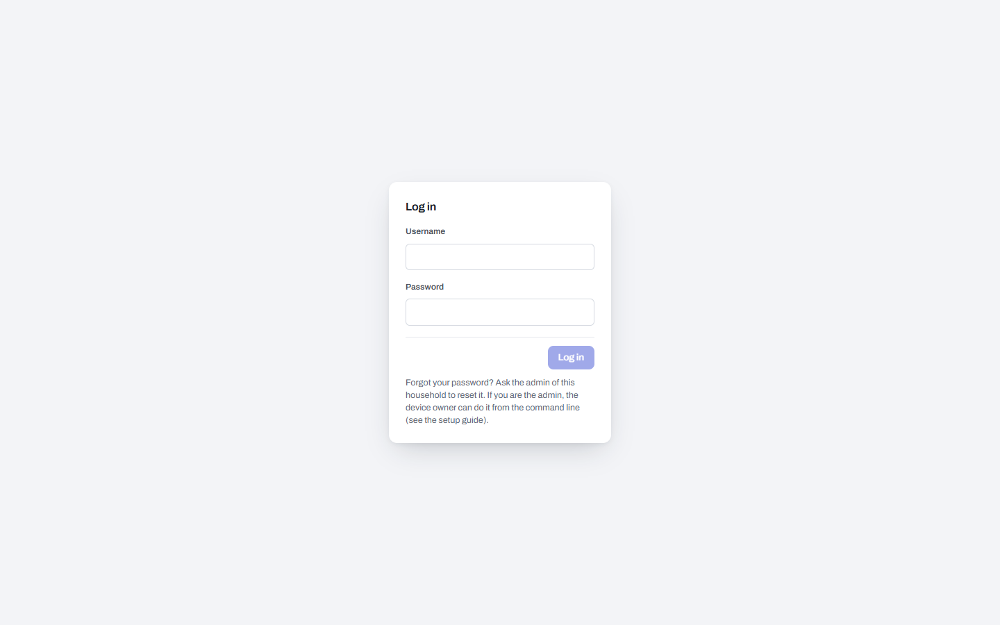
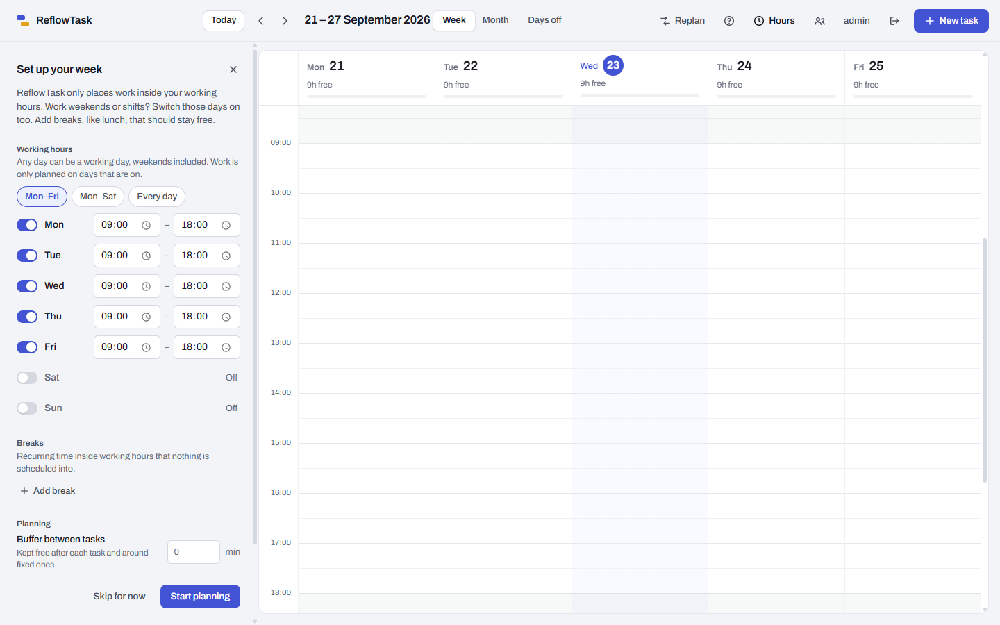
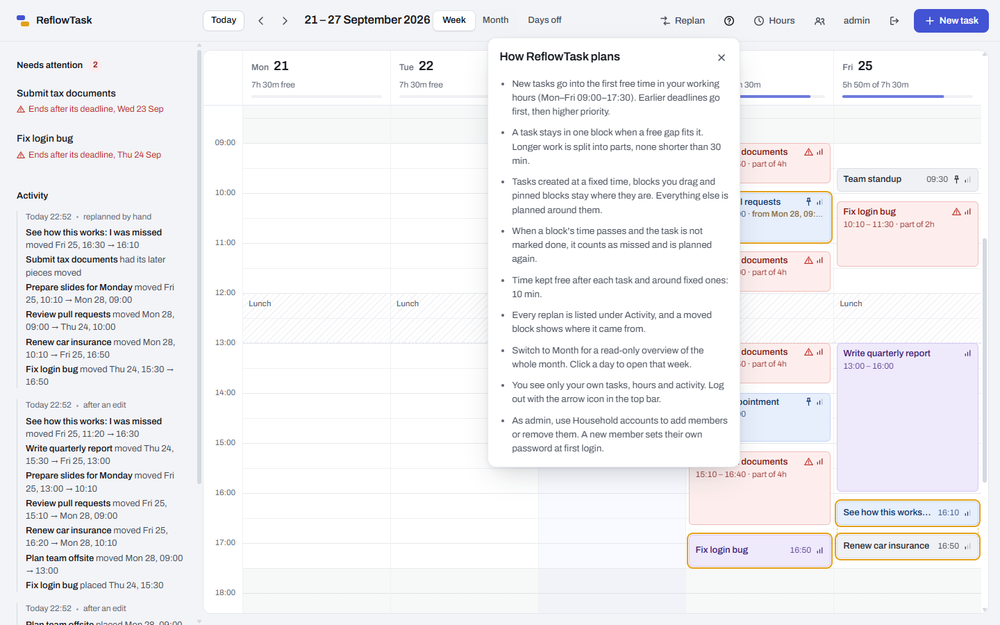
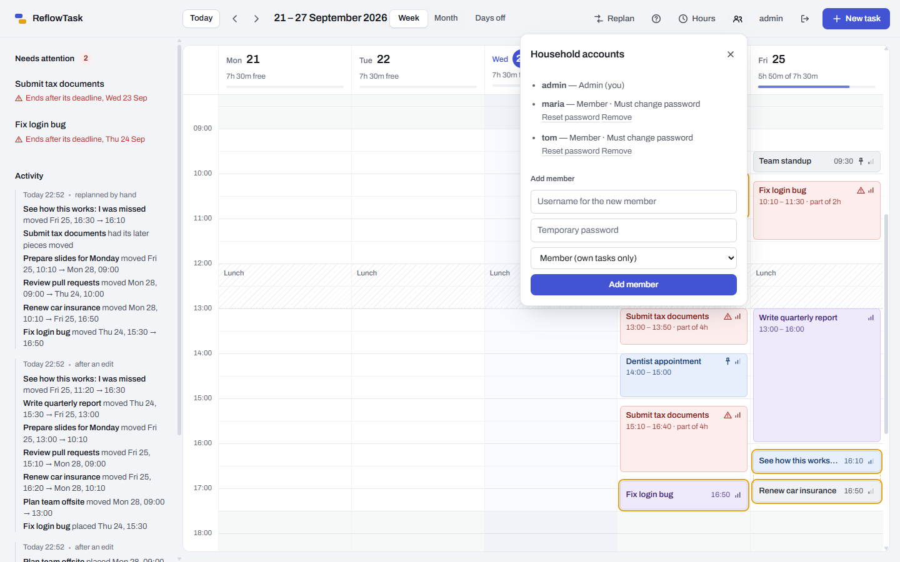

# Setting up ReflowTask

This guide takes you from an empty machine to a running planner that the whole household can use,
and covers what comes after: adding people, reaching it from your phone, updating, backing up and
recovering a forgotten password.

- [What you need](#what-you-need)
- [1. Install Docker](#1-install-docker)
- [2. Download and configure](#2-download-and-configure)
- [3. Start it](#3-start-it)
- [4. First login](#4-first-login)
- [5. Add the people in your household](#5-add-the-people-in-your-household)
- [Reaching it from your phone or away from home](#reaching-it-from-your-phone-or-away-from-home)
- [HTTPS](#https)
- [Updating](#updating)
- [Backing up and restoring](#backing-up-and-restoring)
- [Forgot a password?](#forgot-a-password)
- [Configuration reference](#configuration-reference)
- [Running without Docker](#running-without-docker)
- [Troubleshooting](#troubleshooting)
- [Uninstalling](#uninstalling)

## What you need

| | |
| --- | --- |
| A machine that stays on | A Raspberry Pi 4 or 5 (64-bit Raspberry Pi OS), a home server, a NAS that runs Docker, or an old laptop. Windows and macOS with Docker Desktop work too. |
| Memory | About 1 GB free while it runs. Building the image needs more: on a board with 2 GB or less, add swap first (see [Troubleshooting](#the-build-is-killed-or-runs-out-of-memory)). |
| Software | Docker with the Compose plugin, and Git. |
| Network | Your devices reach the machine on your home network. Nothing has to be opened to the internet, and it should not be. |

## 1. Install Docker

On Raspberry Pi OS or any Debian/Ubuntu machine:

```bash
curl -fsSL https://get.docker.com | sh
sudo usermod -aG docker $USER      # then log out and back in
docker compose version             # should print a version
```

On Windows or macOS, install [Docker Desktop](https://www.docker.com/products/docker-desktop/).

## 2. Download and configure

```bash
git clone https://github.com/KarimBk7/ReflowTask.git
cd ReflowTask
cp .env.example .env
nano .env
```

Set three things in `.env`:

| Setting | What to put |
| --- | --- |
| `POSTGRES_PASSWORD` | A long random password for the database. Only the app uses it, so you will never type it again. |
| `TZ` | The timezone your working hours are in, for example `Europe/Berlin` or `America/New_York`. The scheduler works in wall-clock time, and a container defaults to UTC, so leaving this wrong puts every block at the wrong hour. |
| `REFLOWTASK_PORT` | `8080` | The port the app is reached on |
| `REFLOWTASK_INITIAL_ADMIN_PASSWORD` | The password for the first account (`admin`), at least 8 characters. Remove the `#` in front of the line. |

If you skip the last one, the admin's password is the well-known `changeme` until you log in and
change it. Setting it means the instance is never reachable with a password every copy of this
project shares.

## 3. Start it

```bash
docker compose up -d --build
```

The first run downloads the base images and builds the backend and frontend, and the backend build
also runs the whole test suite, so a broken build never gets as far as running. Expect a couple of
minutes on a PC and roughly five to ten on a Raspberry Pi 5. Later starts take seconds.

Check that everything is up:

```bash
docker compose ps            # three services, all "running" or "healthy"
docker compose logs backend  # ends with "Started ReflowtaskApplication"
```

It is now listening on port **8080**. Open `http://<the machine's address>:8080` from any device
on your network. On the machine itself that is <http://localhost:8080>. To find its address, run
`hostname -I` on the machine. To use another port, set `REFLOWTASK_PORT` in `.env` and run
`docker compose up -d` again. Change settings in `.env`, not in `docker-compose.yml`, so that
`git pull` keeps working when you update.

## 4. First login

Log in as `admin` with the password you set.



If you did not set `REFLOWTASK_INITIAL_ADMIN_PASSWORD`, log in with `changeme`; the app then asks
you to choose your own password before it shows anything else.

The first time you log in, a short setup asks for your working hours, breaks and how far ahead to
plan. ReflowTask only places work inside your working hours, so this matters. Any day can be a
working day: if you work weekends or shifts, pick **Mon–Sat** or **Every day**, or switch single
days on. A day you switch on takes the hours of your first working day, which you can then adjust.
You can change all of it later from **Hours**.



When you finish, the app shows one example task that was "missed" and has already been placed again,
so you can see the point of the product right away: the **Activity** list explains what moved and
why. Delete the example whenever you like.

A **How planning works** panel opens once and can be reopened from the `?` button. It fills in your
own working hours.



## 5. Add the people in your household

Everyone gets their own login and their own calendar, hours and history. Nobody sees anybody
else's tasks, not even the admin's.

1. Click the people icon in the top bar (**Household accounts**, visible to admins only).
2. Enter a username (2 to 50 letters, digits, dots, dashes or underscores; case does not matter), a
   temporary password of at least 8 characters, and a role.
3. Click **Add member** and tell the person their username and temporary password.



The new person logs in, is asked to choose their own password, and then goes through the same
short setup for their own hours. **Admin** accounts can manage other accounts; **Member** accounts
cannot.

From the same panel an admin can:

- **Reset password** for someone who forgot theirs. It sets a new temporary password, ends all of
  that person's sessions and makes them choose a new one at next login.
- **Remove** an account. This deletes all of its tasks, hours and history, so it asks you to
  confirm. You cannot remove yourself or the last admin.

Anyone can change their own password from the button with their name in the top bar.

## Reaching it from your phone or away from home

On your home Wi-Fi, just open the address from step 3 on the phone. For access away from home,
use a private network rather than opening a port on your router:

1. Install [Tailscale](https://tailscale.com/download) on the machine that runs ReflowTask
   (`curl -fsSL https://tailscale.com/install.sh | sh`, then `sudo tailscale up`) and on your
   phone, signed in to the same account.
2. Open `http://<machine-name>:8080` on the phone, using the machine's name or address shown in the
   Tailscale app.

WireGuard works the same way. **Do not port-forward ReflowTask to the internet.** The login keeps
household members apart; it is not built to be the only thing between the internet and your
calendar.

A session cookie belongs to one hostname, so opening the same server by its home address and by its
Tailscale name means logging in once for each.

## HTTPS

Not required inside a private network, but a reverse proxy adds it. With
[Caddy](https://caddyserver.com), for example:

```
reflowtask.home.lan {
    tls internal
    reverse_proxy localhost:8080
}
```

The app sets no `Secure` flag on its cookie precisely so that plain HTTP works, and it keeps
working behind HTTPS. If you use a proxy, no application setting needs to change.

## Updating

```bash
cd ReflowTask
git pull
docker compose up -d --build
```

Database changes are applied automatically at startup by Flyway. Take a [backup](#backing-up-and-restoring)
first, especially before an update that adds migrations. Your data lives in the `postgres-data`
Docker volume and survives rebuilds.

## Backing up and restoring

Everything, accounts included, is in the PostgreSQL database.

**Back up** (safe while it runs):

```bash
docker compose exec -T postgres pg_dump -U reflowtask reflowtask > reflowtask-$(date +%F).sql
```

Copy that file somewhere else. A nightly cron entry is enough for a household:

```
0 3 * * *  cd /home/pi/ReflowTask && docker compose exec -T postgres pg_dump -U reflowtask reflowtask > /home/pi/backups/reflowtask-$(date +\%F).sql
```

**Restore** into a fresh or existing install:

```bash
docker compose stop backend
docker compose exec -T postgres psql -U reflowtask -d postgres \
  -c "DROP DATABASE reflowtask" -c "CREATE DATABASE reflowtask OWNER reflowtask"
docker compose exec -T postgres psql -U reflowtask reflowtask < reflowtask-2026-09-23.sql
docker compose start backend
```

## Forgot a password?

There is no "forgot password" email, because there is no email. Instead:

- **A household member forgot theirs:** an admin opens **Household accounts** and clicks **Reset
  password** next to their name.
- **The admin forgot theirs, or every admin is locked out:** whoever can open a terminal on the
  machine can reset any account, with no login. From the folder with `docker-compose.yml`:

```bash
./scripts/reset-password.sh admin                  # generates and prints a temporary password
./scripts/reset-password.sh admin "my-temp-pass-1" # or choose one (8+ characters)
```

```
Password reset for 'admin'.
Temporary password: ebtFLxPu8wVt
They must choose a new one at next login; all their sessions were ended.
```

The temporary password works once: the person is made to choose their own straight away. Having a
shell on the device is the credential, which is why this needs no login. The same command also
clears a login lockout.

On Windows, run the script in Git Bash or WSL, or run the command below directly.

The script is a thin wrapper. It runs `docker compose exec -T backend java -jar app.jar` with
`--spring.main.web-application-type=none --reflowtask.reset-password.username=<name>`, so you can
run that yourself, or the equivalent against a jar you started without Docker.

## Configuration reference

Set these in `.env` (Docker) or as environment variables.

| Variable | Default | Meaning |
| --- | --- | --- |
| `POSTGRES_PASSWORD` | none, required | Password of the bundled PostgreSQL database |
| `TZ` | `Europe/Berlin` | Timezone the working hours are in |
| `REFLOWTASK_INITIAL_ADMIN_PASSWORD` | unset | First admin's password (8+ characters). Applied only while the admin still has the placeholder password, and never overwrites one you chose. |
| `REFLOWTASK_REFLOW_CRON` | `0 0 * * * *` | When the missed-work check runs (Spring cron, six fields). Hourly by default; `-` disables it. |
| `SPRING_DATASOURCE_URL`, `_USERNAME`, `_PASSWORD` | set by `docker-compose.yml` | Database connection, if you run PostgreSQL yourself |

Working hours (any day of the week, weekends included), breaks, buffer, planning horizon and
minimum block size are set per person in the app, under **Hours**. The week view hides days
without working hours; the **Days off** button shows them.

## Running without Docker

You need Java 25, Node.js 22 or newer, and PostgreSQL (or nothing, for a quick try with the
built-in H2 file database).

**Just trying it out** (H2, no PostgreSQL):

```bash
cd backend && ./mvnw spring-boot:run          # http://localhost:8080
cd frontend && npm install && npm run dev     # http://localhost:5173
```

Log in as `admin` / `changeme`. The H2 file lives in `backend/data/`. To use your own password, set
`REFLOWTASK_INITIAL_ADMIN_PASSWORD` before the first start.

**A real install on PostgreSQL:**

```bash
cd backend && ./mvnw -B package
cd ../frontend && npm ci && npm run build      # static files in frontend/dist

export SPRING_PROFILES_ACTIVE=prod
export SPRING_DATASOURCE_URL=jdbc:postgresql://localhost:5432/reflowtask
export SPRING_DATASOURCE_USERNAME=reflowtask
export SPRING_DATASOURCE_PASSWORD=...
export TZ=Europe/Berlin
java -jar ../backend/target/reflowtask-*.jar
```

Serve `frontend/dist` with any web server and proxy `/api/` to `http://localhost:8080/api/`, as
`frontend/nginx.conf` does, so the browser sees one origin.

To reset a password with a jar, stop the app if it uses the H2 file (H2 allows one process), then:

```bash
java -jar backend/target/reflowtask-*.jar --spring.main.web-application-type=none \
  --reflowtask.reset-password.username=alice
```

## Troubleshooting

**I cannot reach it from another device.**
Check `docker compose ps`, then open `http://<machine-address>:8080` (not `localhost`) from the other
device. Make sure the machine's firewall allows port 8080 (`sudo ufw allow 8080/tcp` if you use
ufw).

**"Bind for 0.0.0.0:8080 failed: port is already allocated".**
Something else uses port 8080. Set `REFLOWTASK_PORT=8090` (or any free port) in `.env` and run
`docker compose up -d` again.

**Blocks show up at the wrong hour.**
`TZ` in `.env` does not match the timezone you think in. Fix it and run `docker compose up -d`.

**"Too many failed attempts. Try again in a minute."**
Five wrong passwords lock that username for a minute. Wait, or reset the password as described
above, which also clears the lockout.

**I am sent back to the login screen.**
Your session ended: it lasts 30 days, and it also ends when an admin resets your password or removes
your account.

**"Cannot reach the server."**
The backend is not running or is still starting. `docker compose logs backend` shows why.

**The backend keeps restarting and the log says the database password is wrong.**
`POSTGRES_PASSWORD` was changed after the database was first created. The database keeps the old
one. Either put the old password back in `.env`, or, if you have no data yet, run
`docker compose down -v` to start over.

**The build is killed or runs out of memory.**
On a board with 2 GB of RAM or less, add swap before building. On Raspberry Pi OS versions that
use `dphys-swapfile` (check with `systemctl status dphys-swapfile`):

```bash
sudo dphys-swapfile swapoff
sudo sed -i 's/^CONF_SWAPSIZE=.*/CONF_SWAPSIZE=2048/' /etc/dphys-swapfile
sudo dphys-swapfile setup && sudo dphys-swapfile swapon
```

On other systems, create a swap file with `fallocate`, `mkswap` and `swapon`, as your distribution
documents.

**I want to see what is going on.**
`docker compose logs -f backend` follows the backend. The hourly job logs a line whenever it
moves something in someone's schedule.

## Uninstalling

```bash
docker compose down        # stops it and keeps your data
docker compose down -v     # stops it and DELETES all data, accounts included
```
